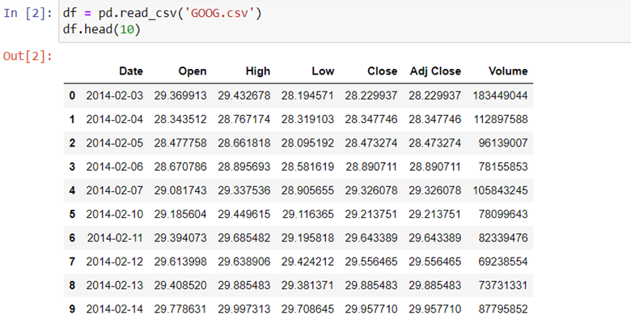
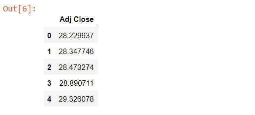
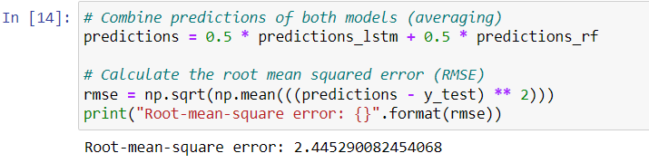
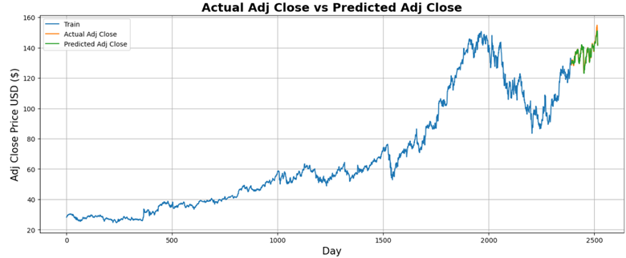
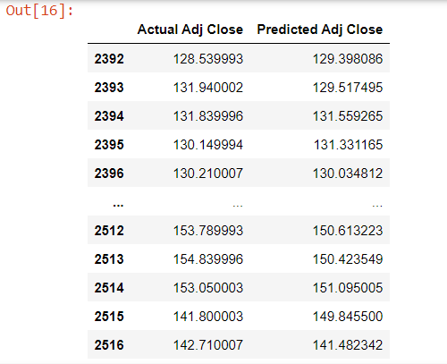

# Stock Price Prediction

This repository contains the implementation of a hybrid stock price prediction model for Alphabet Inc. (Google) using Long Short-Term Memory (LSTM) and Random Forest. The model leverages the advantages of both LSTM for capturing temporal dependencies and Random Forest for robust regression, aiming to provide accurate predictions of the adjusted closing prices of the stock.

## Details

### Data
The dataset consists of historical stock data for Alphabet Inc. (Google) over the past ten years (from 2014-02-03 to 2024-02-01). The data was sourced from Yahoo Finance [here](https://finance.yahoo.com/quote/GOOG/history/), which consists of 2225 article and summary text files in .txt format. The dataset has been preprocessed and converted into a CSV file named `bbc_news.csv`. and includes 2517 entries. The adjusted closing price (Adj Close) was used for training and testing the model, as it is considered more accurate than the closing price (Close).

    
    

### Model Overview
The hybrid model combines the predictions of an LSTM network and a Random Forest regressor. The predictions from both models are averaged to produce the final prediction. This approach leverages the strengths of both models to enhance prediction accuracy.
* LSTM Model
    * Architecture: The LSTM model consists of two LSTM layers followed by two dense layers.
    * Optimizer: Adam optimizer was used for training, with a learning rate of 0.001.
    * Hyperparameters: The model was trained for 20 epochs with a batch size of 32.

* Random Forest Model
    * Hyperparameters: The Random Forest regressor was trained with 300 decision trees (n_estimators) and a random state of 42.

### Results
The model's predictions of the adjusted closing prices were close to the actual values, with the RMSE fluctuating between 2.4 and 2.6. The use of StandardScaler instead of MinMaxScaler, and the combination of LSTM and Random Forest models, provided robust results.

    
    
    

## Usage
Run the python script "stock_prediction.py"

## Dependencies
* python 3
* Libraries used:
    * pandas
    * numpy
    * keras
    * scikit-learn

